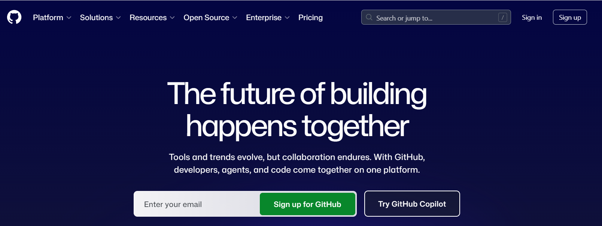
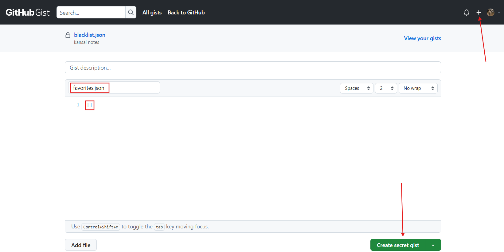
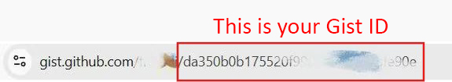
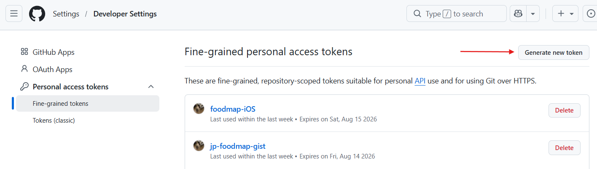
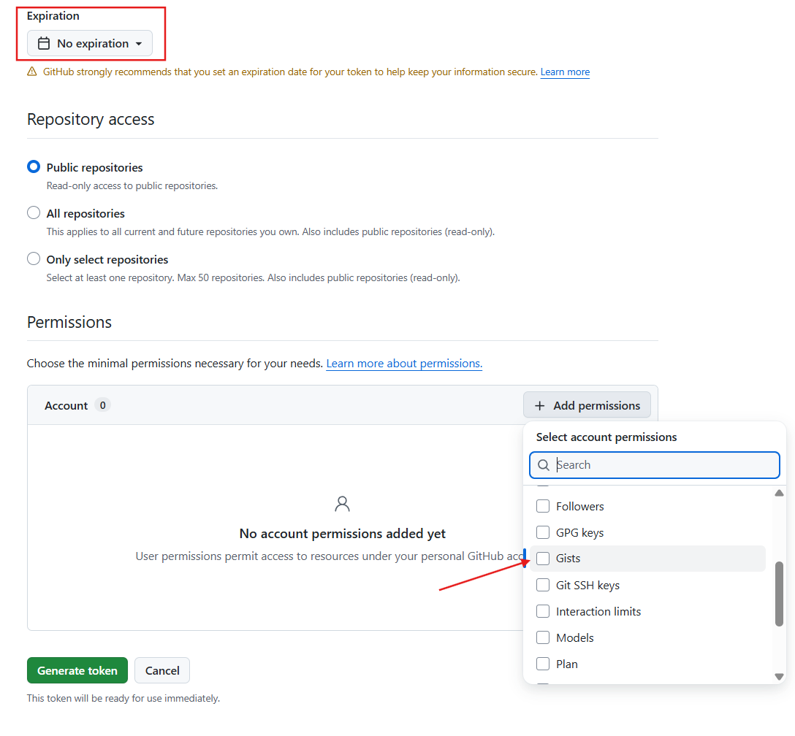
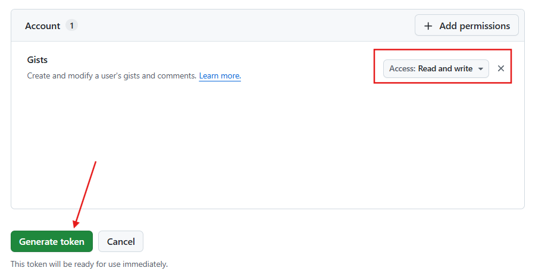
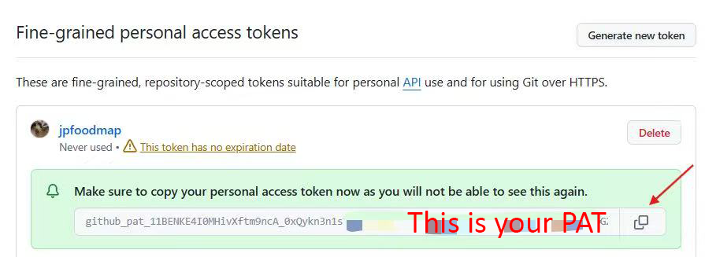
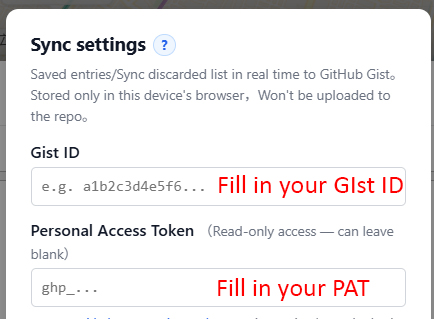

# 同步教程

把收藏餐廳名單 / 棄用餐廳名單（不再顯示在地圖上） / 自定義地標（如景點、酒店等）進行雲端同步，跨設備共用。

---

## 步驟

1. **註冊 / 登入 GitHub**
   打開 <https://github.com> ，登入 / 註冊一個帳號。

   

2. **新建一份 Gist**
   打開 <https://gist.github.com> ，filename 填 `favorites.json`，內容填 `[]`，右下角點 **Create secret gist**。

   

   創建後地址欄裡 `gist.github.com/<用戶名>/` 後面那串十六進制就是 **Gist ID**，複製下來，等下要填進網站。

   

3. **生成 PAT**
   打開 <https://github.com/settings/tokens?type=beta> ，右上角點 **Generate new token**。

   

   - Token name：隨便填
   - Expiration：建議 **No expiration**
   - 往下拉到 **Permissions** → **Add permissions** → 搜並勾 **Gists**

   

   把 **Gists** 的 Access 改成 **Read and write**，拉到底點 **Generate token**。

   

   **馬上複製**生成的 `github_pat_...`（只顯示一次，關掉就再也看不到）。

   

4. **填進我的網站**
   回到地圖 → 左下角 🎛 → 拉到底 → **⚙️ 同步設置** → 貼上 Gist ID + PAT → **保存並測試**。

   

看到 **✓ 配置成功** 就通了。之後每次 ⭐ / 🚫 都會自動同步。

---

## 其他設備 / 其他瀏覽器

在本網站的同步設置裡重新填入已有的 Gist / PAT，就可以隨時拉取你已經同步到雲端的個人收藏 / 棄用 / 景點名單。

---

## 常見問題

- **左下角紅色按鈕還在閃？** 刷新頁面；如果還閃，看同步設置底部的狀態欄 —— *HTTP 403* 一般是 PAT 沒勾 *Read and write*，重做步驟 3。
- **不填 Gist 怎麼辦？** 本地做的所有修改無法被同步，一旦換瀏覽器 / 換設備 / 清空瀏覽器緩存，就看不到了。
- **只填 Gist 不填 PAT 怎麼辦？** 可以看到收藏 / 棄用 / 景點名單，但是更改無法被同步到雲端（只讀但不可修改）。
